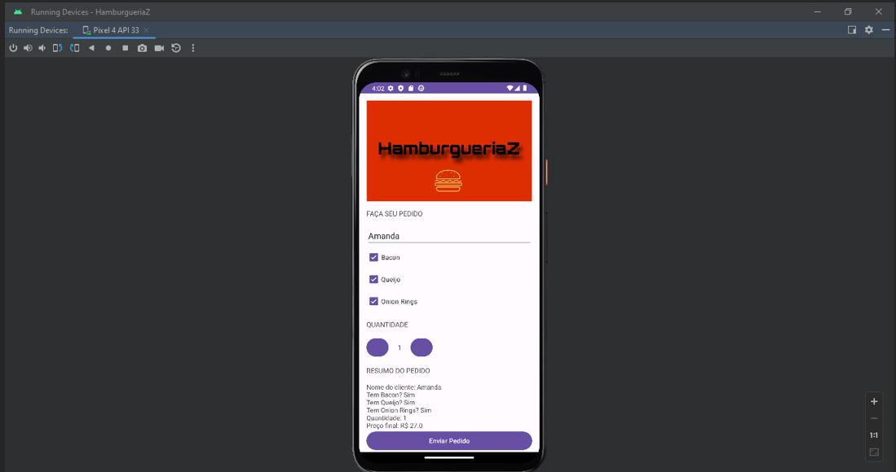
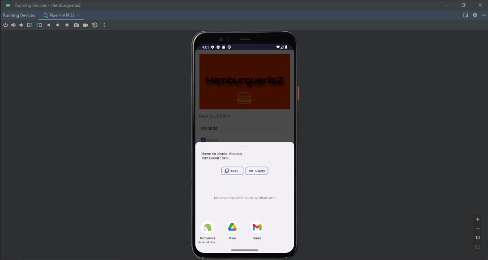

# 🍔 HamburgueriaZ - Android App

Mobile application developed in Android Studio using Java.  
This app simulates a burger ordering system with customizable options and email integration.

## 🎥 Demo

---

## 📱 Features

- Select burger extras (Bacon, Cheese, Onion Rings)
- Adjust quantity dynamically
- Order summary generation
- Email integration using Intent
- User input handling

---

## 🛠️ Technologies

- Java
- Android Studio
- XML (UI Design)
- Intent (Email integration)

---

## 🌍 Language

- App interface: Portuguese  
- Documentation: English

---

## 📸 Screenshots

### Order Screen

### Email Intent

---

## 🚀 How it works

1. User enters their name
2. Selects extras
3. Adjusts quantity
4. App generates order summary
5. Opens email app with order details

---

## 📌 Overview

This project demonstrates the implementation of core Android development concepts, including UI design, event handling, and integration with external applications through Intents.

---

## 👩‍💻 Author

Amanda Lima  
